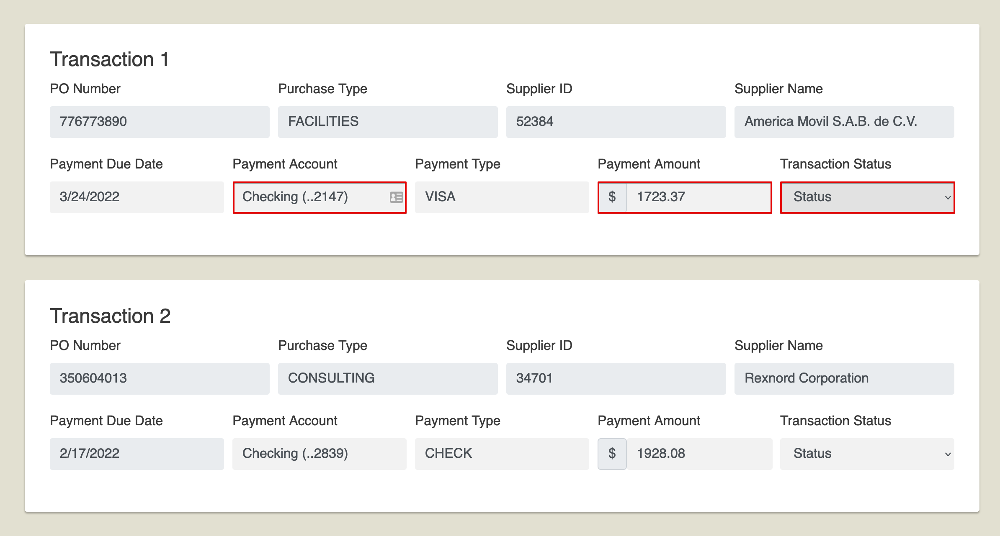

# Quarter Close Challenge



This robot solves the [Quarter Close Challenge](https://developer.automationanywhere.com/challenges/automationanywherelabs-quarterclose.html).

> Create a bot that can review all the transactions displayed on the challenge page and for each of these transactions, find the matching transaction in the banking application. If a match is found, mark the transaction as ‘Verified’. If no match is found, mark the transaction as ‘Unverified’ so that the finance team can dig into this transaction further. Update the status for all the transactions on the page and Submit to complete the challenge.

## The robot code

> Note: There is no one and only "correct" solution. This is just one example of how you _might_ use Robocorp to solve this challenge.

The robot uses the [robocorp-browser](https://robocorp.com/docs/python/robocorp/robocorp-browser) library for browser automation.

```python
*@task
def solve_challenge():
    """Complete Close quarter challenge"""
    launch_browser()
    open_transaction_website()
    transaction_data = get_transactions()
    transaction_data = match_transactions(transaction_data)
    update_transaction_statuses(transaction_data)
    submit_challenge()

```
