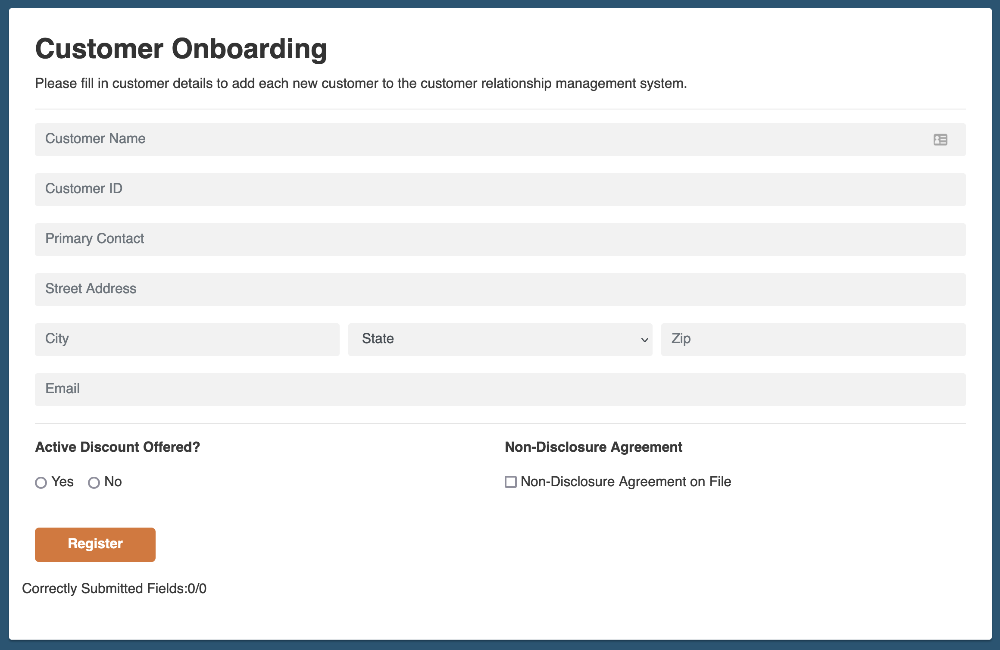

# A robot that completes the customer onboarding challenge



This example robot completes the customer onboarding challenge at <https://developer.automationanywhere.com/challenges/automationanywherelabs-customeronboarding.html>.

The robot uses the [robocorp-playwright](https://robocorp.com/docs/python/robocorp/robocorp-browser) library for browser automation, [RPA.HTTP](https://robocorp.com/docs/libraries/rpa-framework/rpa-http) library for downloading the CSV file used in the challenge and the [Polars](https://pola-rs.github.io/polars/py-polars/html/index.html) library for reading the CSV into a table data structure.

```python
@task
def solve_challenge():
    """Solve the RPA challenge"""
    browser.configure(
        browser_engine="chromium",
        screenshot="only-on-failure",
        headless=True,
    )
    # user_agent is neede for headless runs
    user_agent = "Mozilla/5.0 (Windows NT 10.0; Win64; x64) AppleWebKit/537.36 (KHTML, like Gecko) Chrome/120.0.0.0 Safari/537.36"
    context = browser.context()
    context.set_extra_http_headers({"User-Agent": user_agent})
    # navigate to challenge page
    browser.goto(URL)
    # get customer data as dataframe
    df_customers = get_customers_data()
    # fill data to crm
    for customer in df_customers.rows(named=True):
        fill_and_submit_form(customer)
    # log screenshot and challlenge id
    challenge_verification()
```

For more information, do not forget to checkout the following:

* [Robocorp Documentation -site](https://robocorp.com/docs/python/robocorp)
* [Portal for more examples](https://robocorp.com/portal)
* [robo repo](https://github.com/robocorp/robo) as this will developed a lot...
