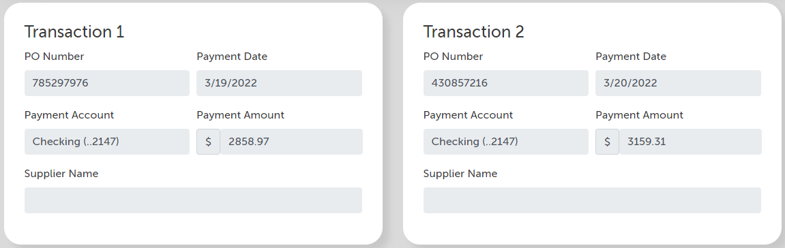

# A robot that completes the financial transaction validation challenge

This example robot completes the supply chain challenge at <https://developer.automationanywhere.com/challenges/financialvalidation-challenge.html>

## More in detail, this automation will

- Start the challenge by opening the challenge page
- Create table of transactions
- Login into Rusty Bank application
- Search for the Supplier name from Rusty Bank's by amount value
- Handle possible errors on Rusty Bank by login in again

## Screens




## Robot

```python
@task
def solve_challenge():
    with log.suppress_variables():
        start_challenge()
        transaction_table = get_transactions()
        bank_page_id = login_to_rusty_bank()
        transaction_table = get_supplier_data(transaction_table, bank_page_id)
        fill_suppliers(transaction_table)
        complete_challenge()
        log.console_message("Challenge completed", "regular")
```
