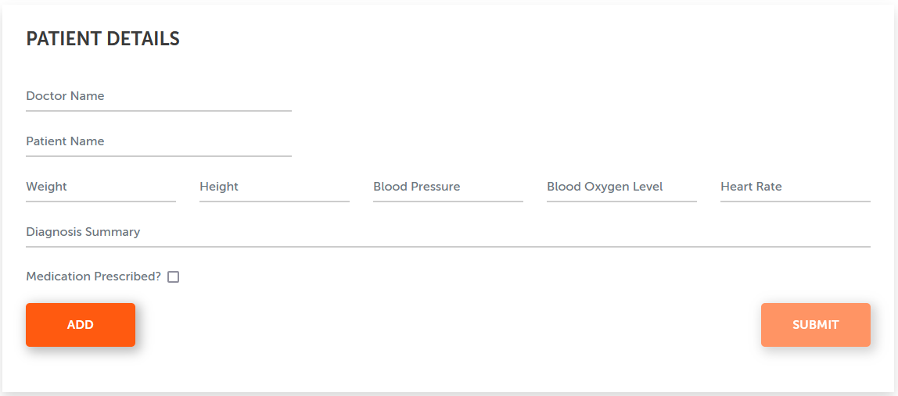
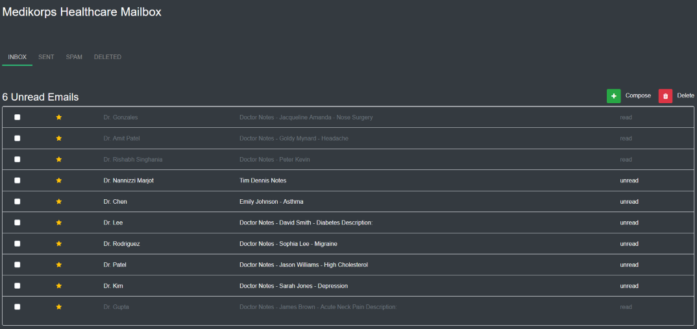

# A robot that completes the healthcare challenge

This example robot completes the supply chain challenge at <https://developer.automationanywhere.com/challenges/healthcare-ai-challenge.html>. Automation expects vault secret with ChatGpt key to be available!

## More in detail, this automation will

- Start the automation by opening the challenge page
- Open mailbox site
- List all unread emails and retrieve their content
- For each mail pass content to ChatGpt to get structured content
- Insert structured patient data in patient details

## Screens




## Robot

```python
@task
def solve_ai_challenge():
    start_ai_challenge()
    mailbox_page = open_mailbox()
    patient_cases = get_unread_mail_content(mailbox_page)
    patient_cases = get_structured_data_from_gpt(patient_cases)
    fill_patient_data(patient_cases)
    submit_challenge()
    log.console_message("Challenge completed", "regular")
```

## Prompt for gpt

Prompt used by automation was created by ChatGPT

``` text
Extract Key Values from Medical Messages

Analyze the following messages and extract the specified key values:

- Patient Name: Extract the patients name as a string.
- Diagnosis: Extract the diagnosis as a string.
- Medicines Prescribed: Extract the prescribed medicines, separating them with a comma.
- Blood Pressure: Extract the blood pressure as a single string value.
- Weight: Extract the weight as a string value.
- Height: Extract the height as a string value.
- Blood Oxygen Level: Extract the blood oxygen level as a string value.
- Resting Heart Rate: Extract the resting heart rate as a string value.

Return the extracted values in the below standard JSON format:

{
  "PatientName": "",
  "Diagnosis": "",
  "MedicinesPrescribed": "",
  "BloodPressure": "",
  "Weight": 0,
  "Height": 0,
  "BloodOxygenLevel": 0,
  "RestingHeartRate": 0
}

Note: Ensure that the specified values are accurately extracted and formatted according to the JSON template provided.
Note: To not add any comments or explanations
```
