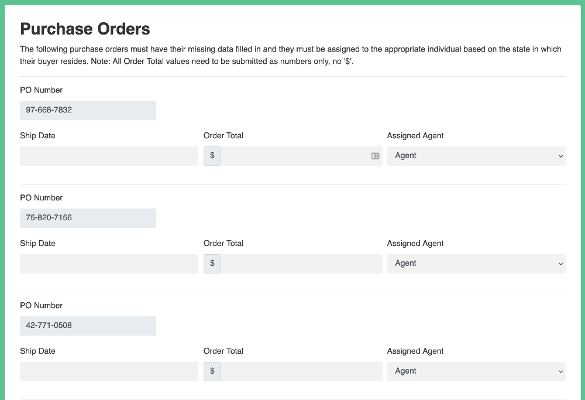

# A robot that completes the supply chain challenge



This example robot completes the supply chain challenge at <https://developer.automationanywhere.com/challenges/automationanywherelabs-supplychainmanagement.html>.

The robot uses the [robocorp-playwright](https://robocorp.com/docs/python/robocorp/robocorp-browser) library for browser automation, [RPA.HTTP](https://robocorp.com/docs/libraries/rpa-framework/rpa-http) library for downloading the CSV file used in the challenge and the [Polars](https://pola-rs.github.io/polars/py-polars/html/index.html) library for reading the excel into a data structure.

```python
@task
def solve_challenge():
    """Complete the supply chain challenge"""
    launch_browser()
    open_procurement_website_and_log_in()
    purchase_order_page = open_po_page()
    agents_df = get_agents(purchase_order_page)
    po_numbers = get_po_numbers(purchase_order_page)
    get_po_data_and_insert_to_form(agents_df, po_numbers, purchase_order_page)
    challenge_verification(purchase_order_page)
```

For more information, do not forget to checkout the following:

* [Robocorp Documentation -site](https://robocorp.com/docs/python/robocorp)
* [Portal for more examples](https://robocorp.com/portal)
* [robo repo](https://github.com/robocorp/robo) as this will developed a lot...
