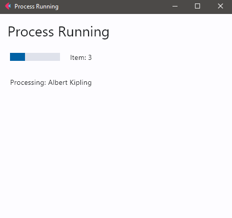
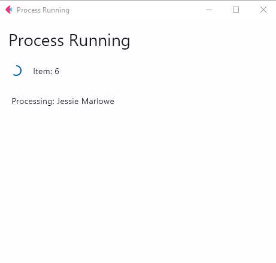

# Example robot with progress indicators

Robot that uses dialog to initiate the process and displays progress during processing

## Code

```robot
*** Tasks ***
Complete rpa challenge
    [Documentation]
    ...    The completes rpa challenge and
    ...    displays process progress

    Display Process Run
    ${result}    RPA.Assistant.Run Dialog
    ...    title=Assistant Template
    ...    on_top=True
    ...    height=450
    IF    "${result.submit}" == "Cancel"
        Log    \nProcess Canceled    console=True
    ELSE
        Log    \nProcess Completed    console=True
    END
    Collect the results
```

## Dialog examples

<p float="left">


</p>

More about [attended vs. unattended robots](https://robocorp.com/docs/control-room/attended-or-unattended) and specifically [attended automations](https://robocorp.com/docs/control-room/attended)

## Learning materials

- [Robocorp Developer Training Courses](https://robocorp.com/docs/courses)
- [Documentation links on Robot Framework](https://robocorp.com/docs/languages-and-frameworks/robot-framework)
- [Example bots in Robocorp Portal](https://robocorp.com/portal)
